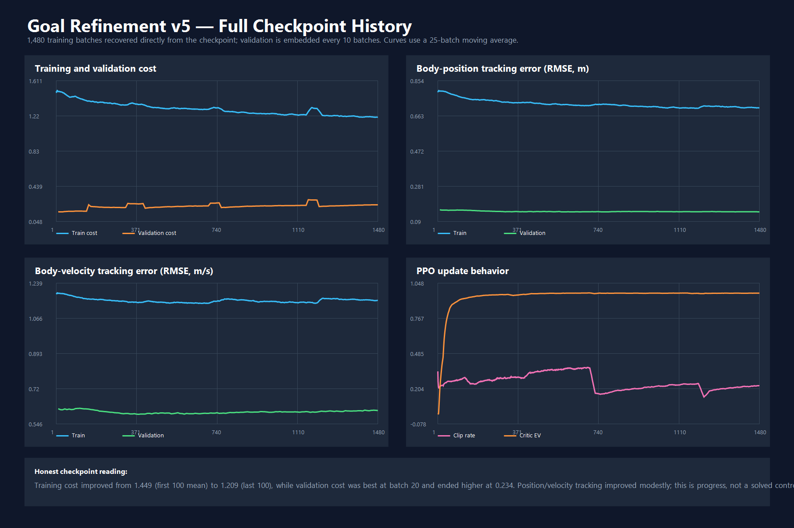

# RL-Based Humanoid Motion Generation with Reference Trajectory Control

Research code for turning recorded human motion into MuJoCo trajectories, testing those trajectories under torque-limited control, and learning goal corrections when direct tracking fails.

## Project in one glance

```text
Recorded motion at 40 Hz
        |
        v
Retargeting and motion validation
        |
        v
Supervised 2-layer LSTM trajectory planner
        |
        v
Recurrent PPO residual goal policy
        |
        v
400 Hz PD control and MuJoCo-Warp physics
        |
        v
Tracking, feasibility, and contact diagnostics
```

[Goal Planner Demonstration](https://drive.google.com/file/d/1_TvY84Vsf9K0rAkNClDOgE5-6hx9far5/view?usp=sharing)

The simulated body has 47 actuators and 24 tracked bodies. The project evolved through four research stages; the full history matters because the latest experiment is not yet a solved system.

## Honest result

The preserved v5 residual-refinement checkpoint contains 1,480 training records.

| Measurement | Beginning | End |
|---|---:|---:|
| Mean training cost, 100-batch window | 1.449 | 1.209 |
| Validation position RMSE | 0.154 m | 0.143 m |
| Validation velocity RMSE | 0.622 m/s | 0.613 m/s |
| Validation total cost | 0.157 | 0.234 |
| Critic explained variance | near 0 | 0.972 training / 0.926 validation |

Tracking improved modestly and the critic learned the return structure, but total validation cost worsened. This repository presents the result as an ongoing investigation, not a completed success.



For the staged research history and detailed result notes, see [`results/VERSION_HISTORY.md`](results/VERSION_HISTORY.md) and [`results/README.md`](results/README.md).

## Repository layout

```text
src/          Planner, controller, RL, and motion-processing code
configs/      MuJoCo body, PD gains, normalization, and residual scale
models/       Goal-planner and v5 goal-refinement checkpoints
results/      Extracted checkpoint history, CSV metrics, and figures
```

## Main entry points

```powershell
python src/trajectory/Goal_Planner.py --stop 1
python src/rl/Feedbacked_Goal_Refinement_Learning.py --stop 1
python src/control/View_PD_Control.py --checkpoint_compare
python src/control/View_PD_Control.py --checkpoint_pd
python src/control/View_PD_Control.py --planner_compare
```

## Current Status/Next Steps

- The current goal-refinement model improves training cost and position tracking; however, sample efficiency and limited computational resources make it difficult to test additional model variants. I implemented regional learning as a curriculum, together with cumulative and smoothed exploration noise, to make the perturbations more meaningful, but further experiments are necessary to identify the main bottleneck.
- The goal planner produces usable trajectories, but several demonstrations show unnecessary intermediate motion that cannot be inferred from the start and end states alone. The next step is to test reinforcement learning or early stopping.
- The final integration step is to connect the goal planner and goal-refinement policy: generate a trajectory from the start and end states, then refine the intermediate goals before PD tracking.
